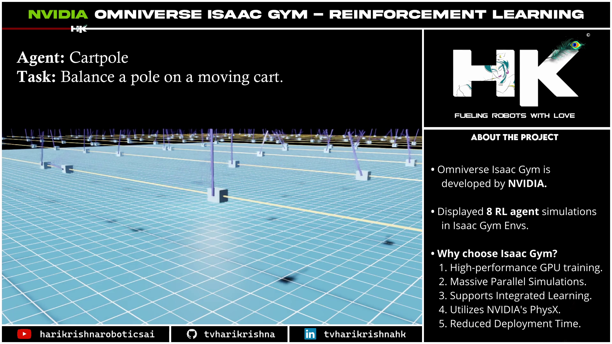
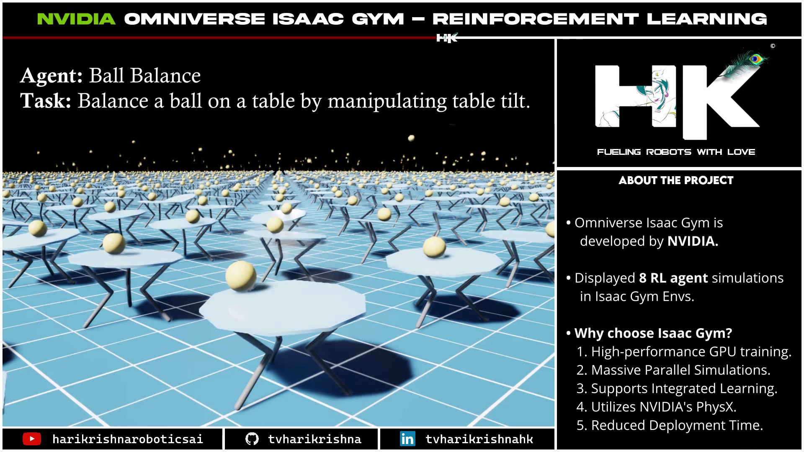

<!------ PROJECT TITLE ------>

    

    

<!------ WHAT ------>

    

 

<h1>🎀 Essence of the Project</h1>

This introduction explores the capabilities of Reinforcement Learning (RL) agents within NVIDIA Isaac Gym, showcasing how advanced simulation environments accelerate the development and training of autonomous robotic systems. By leveraging NVIDIA Isaac Gym, researchers and developers can simulate complex robotic interactions and tasks, enabling rapid prototyping and iterative learning without the physical wear and tear on actual robots.

  

 
     

<!------ WHY ------>

    

<h1>🎯 Project Vision</h1>

Training RL agents in robotics is vital as it allows for the optimization of algorithms that can improve learning efficiency and effectiveness. The real-time feedback and simulation environment provided by Isaac Gym offer a controlled setting where numerous scenarios and their variables can be tested swiftly and accurately, ensuring that the agents learn optimal behaviors for real-world applications while minimizing risks and costs associated with physical testing.

 
     

<!------ HOW ------>

    

<h1>🪓Project Implementation</h1>

<h2>💠 Software Design & Tools </h2>

The project utilizes NVIDIA Isaac Gym as the primary tool to simulate and visualize the behavior of various RL agents across multiple environments. This powerful simulation platform integrates seamlessly with modern GPU technology to provide high-fidelity physics simulation, which is essential for the realistic rendering and interaction of complex robotic models.

 &nbsp;

  

<!------ Deployment and Testing ------>

<h2>💠 Deployment and Testing </h2>

Displayed 8 RL agents trained in NVIDIA Isaac Gym, demonstrating the diverse range of tasks and environments these agents can adapt to, thereby showcasing their versatility and the power of using Isaac Gym for robotics simulation and learning.
  
    

    

  

    

  

    

  

    

  

    

  

    

  

    

  

    

 
     

<!------ End Image ------>

    

