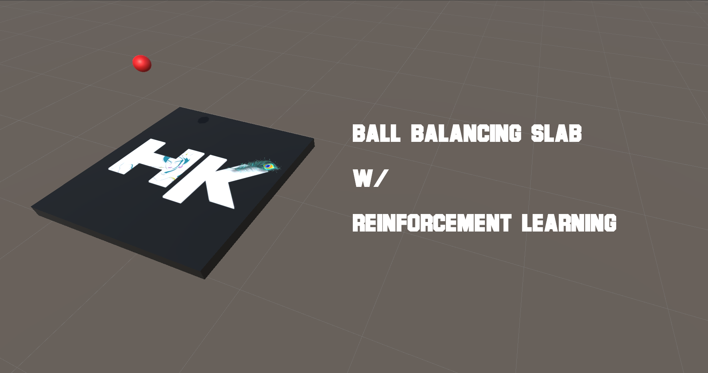
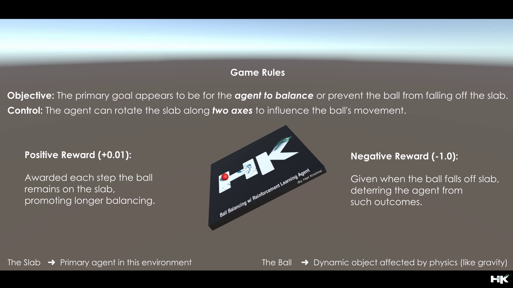
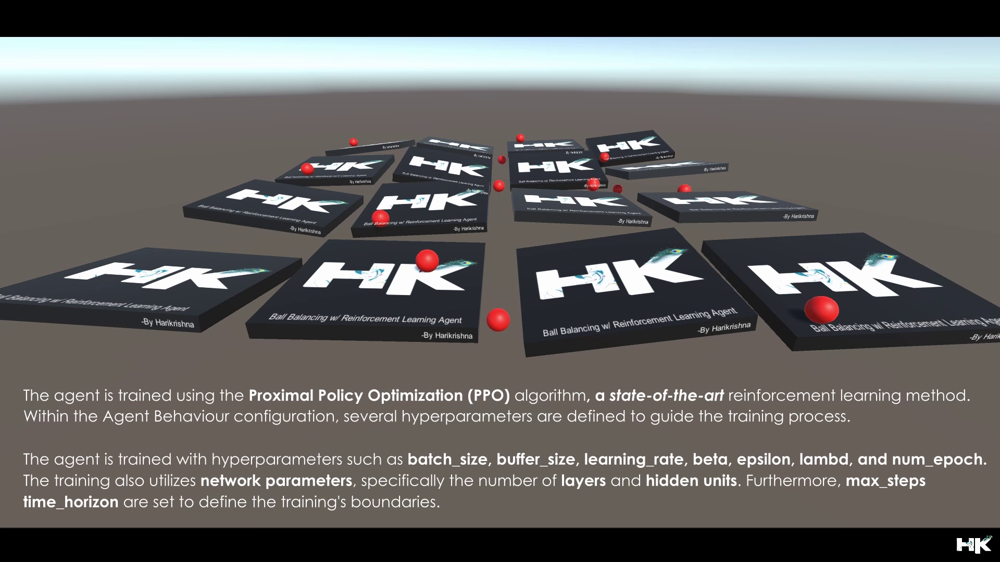
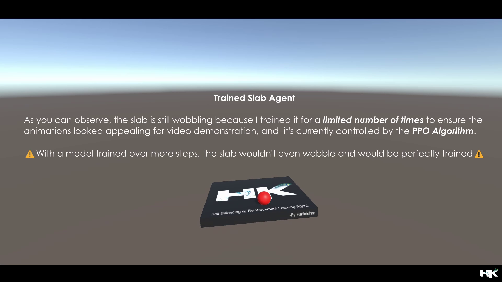

 &nbsp;
 &nbsp;
 &nbsp;

© 𝗗𝗼𝗰𝘂𝗺𝗲𝗻𝘁𝗮𝘁𝗶𝗼𝗻 𝗯𝘆 𝘁𝘃𝗵𝗮𝗿𝗶𝗸𝗿𝗶𝘀𝗵𝗻𝗮

5 𝘮𝘪𝘯𝘶𝘵𝘦 𝘳𝘦𝘢𝘥 📚 
  

<!------ PROJECT TITLE ------>

    

    

<!------ WHAT ------>

    

<h1>🎀 Essence of the Project</h1>

Implementation of the Proximal Policy Optimization (PPO) algorithm for a ball balancing slab in reinforcement learning. This technique optimizes the control policy to maintain the ball's position on the slab, adapting to variations in the environment. The goal is to develop a robust and adaptable system that can effectively balance the ball under dynamic conditions, enhancing stability and response accuracy.

  

    

<!------ WHY ------><!------ WHY ------><!------ WHY ------>

    

<h1>🎯 Project Vision</h1>

▸ ADD TEXT HERE
▸ ADD TEXT HERE 
▸ ADD TEXT HERE 

    

<!------ HOW ------><!------ HOW ------><!------ HOW ------>

    

<h1>🪓Project Implementation</h1>

<h2>💠 Software Design & Tools </h2>

The project's PID controller is built and developed using the Robot Operating System (ROS), leveraging Ubuntu and Linux for its operating environments. Utilizing Python for scripting, the simulation of the autonomous systems is conducted in Gazebo, a powerful tool for robot simulation. Visualization of the path traveled, waypoints, and other critical metrics are meticulously rendered in RViz, with ROS markers enhancing the clarity and interpretability of the data. This integration of software tools, including Numpy and SciPy for numerical computations and VS Code as the development environment, ensures a robust framework for designing, simulating, and visualizing complex autonomous vehicle behaviors.

<!------ Deployment and Testing ------><!------ Deployment and Testing ------><!------ Deployment and Testing ------>

<h2>💠 Deployment and Testing </h2>

▸ ADD TEXT HERE
▸ ADD TEXT HERE 
▸ ADD TEXT HERE 

<!------ Result and Analysis ------><!------ Result and Analysis ------><!------ Result and Analysis ------>

<h2>💠 Results & Analysis </h2>

▸ ADD TEXT HERE
▸ ADD TEXT HERE 
▸ ADD TEXT HERE 

<!------ End Image ------><!------ End Image ------><!------ End Image ------>

    

## About this Project:

  

---------------------------------------------

## Game Rules:
The project is designed to demonstrate a reinforcement learning (RL) scenario where an AI agent is tasked with balancing a ball on a slab. The agent receives a small positive reward incrementally for each time step that the ball stays on the slab, encouraging the agent to learn strategies for maintaining balance. Conversely, a negative reward is given when the ball falls off, which helps the agent to learn from its mistakes and avoid actions leading to such an outcome. This control mechanismS allows the slab to be rotated along two axes, which adds complexity to the task and requires the agent to develop a nuanced understanding of the physics involved.

  

---------------------------------------------

## What is Proximal Policy Optimization (PPO):
Proximal Policy Optimization (PPO) is a policy gradient method for reinforcement learning which alternates between sampling data through interaction with the environment and optimizing a "surrogate" objective function using stochastic gradient ascent. Developed by OpenAI, PPO aims to improve upon the stability and sample efficiency of previous methods like Trust Region Policy Optimization (TRPO) but with simpler implementation and better general performance.

---------------------------------------------

## Key aspects of  include:

    • Clipped Objective: Limits policy updates to prevent excessive changes.
    • Multiple Updates: Allows several mini-batch updates per data sample for better efficiency.
    • KL Penalty/Clipping: Ensures policy updates stay within a "safe" range to maintain training stability.
    • Advantage: PPO is favored for its simplicity, efficiency, and consistent performance across various RL tasks.

  

---------------------------------------------

## Results:

  

---------------------------------------------

## My Project Video Demonstration:

  

---------------------------------------------
