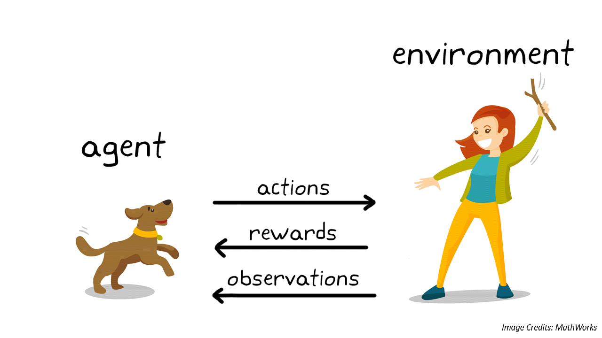
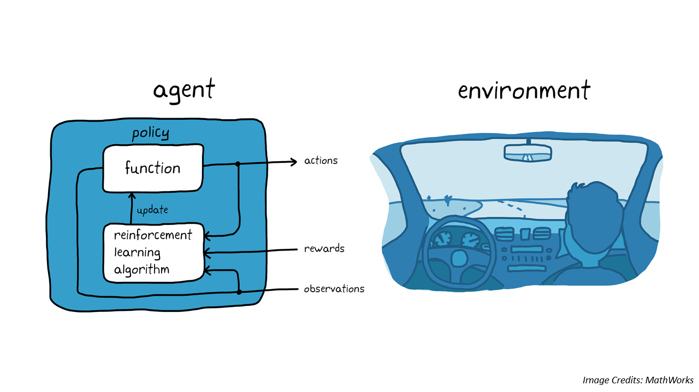
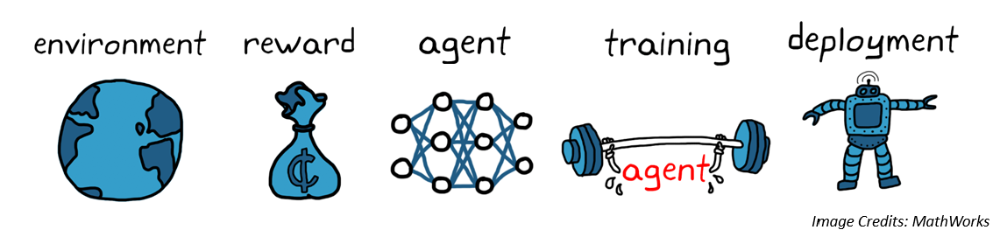

© Documentation by tvharikrishna

1 minute read 📚
  

# 🔻 Repository Details

This repository contains various simulations on agents that currently don't think but, using state-of-the-art simulators like Unreal Engine, PyBullet, MuJoCo, and Unity. I will train different sets of Reinforcement Learning algorithms on these agents and test all algorithms.
 

<h1 align="left">🔻 Repository Details</h1>
<table align="center">
<thead>
<tr>
<th align="center">Naming Prefix</th>
<th align="center">Description</th>
</tr>
</thead>
<tbody>
<tr>
<td align="left"><strong>HK_IsaacGym__</strong></td>
<td align="right">Simulations in Isaac Gym</td>
</tr>
<tr>
<td align="left"><strong>HK_PyBullet__</strong></td>
<td align="right">Simulations in PyBullet</td>
</tr>
<tr>
<td align="left"><strong>HK_MuJuCo__</strong></td>
<td align="right">Simulations in MuJoCo</td>
</tr>
</tbody>
</table>

# 🔻 What is Reinforcement Learning?

Reinforcement Learning (RL) is a type of machine learning where agents learn to make decisions by interacting with an environment to maximize some notion of cumulative reward. It's characterized by trial-and-error, feedback, and the balance between exploration of uncharted territory and exploitation of current knowledge.

    

# 🔻 What are Agents?
An Agent is an entity capable of perceiving its environment, making decisions on what actions to take, and learning from the outcomes of these actions. The agent's goal is to find the best strategy, or policy, that will maximize the cumulative rewards over time. This process involves observing the environment, executing actions, receiving rewards, and updating the policy based on the learned experiences.

    

    

    

 
    

    

